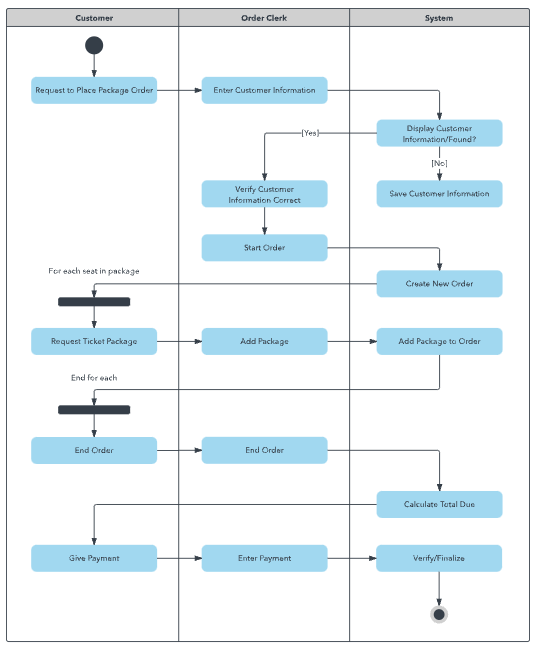
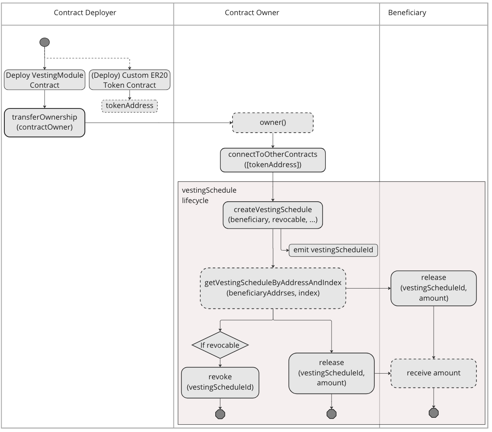

> Function should be labelled and able to be sorted with 
> 1. caller constraints and 
> 2. the likelihood of usage

> e.g. Caller constraints:
> - only ContractOwner
> - specific role  

> e.g. Likelihood of usage:
> - main business-operation:
>   - Specification should be described at HowToUse page.
> - only for emergency case:
>   - no need to be described at HowToUse page.
> - ??

# WRITE(main operation)

## Business Operation
### Business Process Diagrams
They show the “who,” “what,” “when,” “where” and “how” for these steps, and help to analyze the “why.”
Example: 

Sample:

## connectToOtherContracts
~~Connect the underlying pair from dex and the dex router.~~  
Initial setup to connect the module to ERC20 being vested.

> Style: Should describe any constrains for caller.

- Caller constraints: only ContractOwner

|Name|Type|Description|Example|Default|
|--- |---|---|---|---|
|token|address[]|The address of the token that will be vested|[0x690b9a9e9aa1c9db991c7721a92d351db4fac990]|N/A|

## createVestingSchedule

- Caller: only ContractOwner

> 🖋️ **NOTE:**  
> How to get the current block time?

|Name|Type|Unit|Description|Example|Requirement|
|---|---|---|---|---|---|
|_beneficiary|address|account's address|the address of the beneficiary|0x690b9a9e9aa1c9db991c7721a92d351db4fac990|N/A|
|_start|uint256|block time in seconds|the start datetime|1674396730(January 22, 2023 2:12:10 PM)|N/A|
|_cliff|uint256|block time|the pause between the start time and the moment of available withdrawal|1674396730|N/A|
|_duration|uint256|duration of block time in seconds|the duration of the vesting schedule|1674396730|> 0|
|_slicePerSeconds|uint256|token unit|how many tokens will be unlocked every second starting with the startTime.|10|>= 1|
|_revocable|boolean|--|a boolean that gives the owner the power to revoke the vesting schedule or not. This can only be decided when the vesting schedule is created.|true|false|
|_amount|uint256|token unit|how many tokens will be unlocked every second starting with the startTime.|10|less than getWithdrawableAmount() AND > 0|

## revoke

Owner can only revoke a vesting schedule that have been marked as revocable at the moment of creation.

- Caller: only ContractOwner

|Name|Type|Description|Example|Requirement|
|---|---|---|---|---|
|vestingScheduleId|bytes32|The id of the vesting schedule|0x1|0x0|

## release

- Caller: 
    - ContractOwner
    - Beneficiary determined in the vestingSchedule

|Name|Type|Description|Example|Default|
|---|---|---|---|---|
|vestingScheduleId|bytes32|The id of the vesting schedule|0x1|0x0|
|amount|uint256|Amount of tokens that will be release|100|less than computeReleasableAmount()|

# WRITE(emergency case)
- transferOwnership
- renounceOwnership
